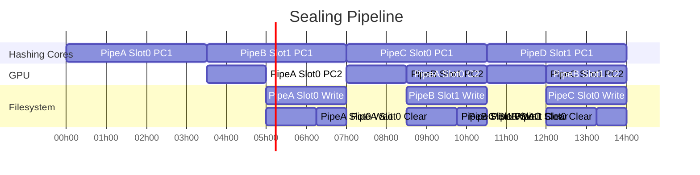

# SupraSeal

SupraSeal is a highly optimized collection of Filecoin sealing primitives intended to be used by storage providers who require high throughput. The PC1, PC2, C1, and C2 subsections provide more details on usage. Note this is not a standalone library, the primitives are intended to be used in a storage providers application of choice.

# Architecture and Design Considerations

## Sealing Operations

For a single sector, the sealing operation is comprised of the following operations: Add Piece, Pre-commit 1, Pre-commit 2, Wait Seed, Commit 1, and Commit 2. In order to maximize application flexibility, SupraSeal is designed to handle a subset of these operations independently. 
- **Add Piece**: the process of concatenating pieces of data in order to fill a sector (e.g. 32GB). SupraSeal does not address this operation given the trivial compute requirements and large number of possible ways to ingest data.
- **Pre-commit 1 (PC1)**: the generation of the stacked depth robust graph. SupraSeal parallelizes this operation across a power of 2 number of sectors, up to 128, and is designed to maximize throughput.
- **Pre-commit 2 (PC2)**: the creation of two Merkle trees comprised of the graph columns and replica. SupraSeal supports the generation of tree c across the parallel sectors created by PC1. For Committed Capacity (CC) sectors, SupraSeal supports the parallel generation of tree r. Alternatively for non-CC sectors (customer data), SupraSeal offers GPU and CPU based single sector replica encoding and tree r generation.
- **Wait Seed**: the 150 epoch (~75 minute) gap between submission of pre-commit2 and the availability of randomness (seed) from the chain. SupraSeal does not interact with the chain, therefore relies on the application for obtaining the seed.
- **Commit 1 (C1)**: the generation of node challenges using the seed. SupraSeal will build the inclusion proofs from the parallel layers generated in PC1 and the Merkle trees for PC2. The C1 api operates on a single sector at a time, as opposed to PC1 and PC2 which operate on all sectors at once. The reason is each sector will have a different set of challenges, thus making the parallelization less effective. If working with non-CC (customer data) sectors, then tree D and tree R must be provided to SupraSeal. Both trees can be generated using deal data through standalone SupraSeal utilities.
- **Commit 2 (C2)**: the zkSNARK proof generation using the inclusion proofs from C1. SupraSeal provides the post constraint evaluation portion of the Groth16 proof. There is no complete C2 api within SupraSeal, the expectation is the heavy Groth16 compute function is integrated directly into the existing Filecoin C2 apis.

For a more detailed discussion of PC1 see [pc1/README.md](pc1/README.md).

## Intended Usage

There are two primary methods for storage providers to participate in the Filecoin network, either by providing CC sectors or servicing customer data. How one uses SupraSeal depends on these methods. Here is a sample flow to consider when building an application on top of SupraSeal.


## Object Sizes 

The table below outlines the object sizes to expect for a 32 GB sector. The total data for a parallel operation would be these values * the number of sectors. Keep this in mind when provisioning hardware. This will impact NVMe and hard drive capacity, memory, and network bandwidth.

| Object       | Size  | Notes    |
|--------------|:-----:|-----------| 
| Piece File |  32 GB | Data to be sealed | 
| Tree D |  64 GB | Piece File is leaves, binary tree on top |
| Replica ID | 32 B | Derived unique identifier for each sector |
| Stacked DRG | 352 GB | PC1 Graph is layers (11) * num_nodes (1B) * 32 B |
| Tree C |  36.6 GB | 8 - arity tree with num_nodes (1B) * 32 B leaves |
| Comm C | 32 B | Tree C Commitment (root of tree C) |
| Tree R |  73.1 MB | Same as Tree C expect leaves are replica and discard 2 rows |
| Tree R Root | 32 B | Root of Tree R |
| Comm R | 32 B | Poseidon hash of Tree C Root || Tree R Root |
| DRG last layer (Key) | 32 GB | Last layer of DRG is the key to encode replica | 
| Replica | 32 GB | Output of sealing process, Piece File + Key |
| Tree D Inclusion Paths | 265 KB | Merkle tree D inclusion paths for C1 challenges |
| Tree R Inclusion Paths | 435 KB | Merkle tree R inclusion paths for C1 challenges |
| C1 Output | 10.5 MB | Result of C1 to provide C2 for proving |

## API

The CC sector API is very straightforward, we have demo code for both C and Rust access. 

```
// Optional init function. If used this must be the first library
// function called.
// \config_file       Topology config file. Defaults to supra_config.cfg
void supra_seal_init(const char* config_file);

// Returns the highest node offset address in the NVMe array. This is useful
//  for calculating if a new PC1 batch of parallel sectors will fit.
size_t get_max_block_offset();

// Returns the size of a PC1 batch for the specified number of parallel sectors.
// Used to calculate the next block offset as well as to determine if
//  enough NVMe space is available.
size_t get_slot_size(size_t num_sectors);

// Perform PC1 operation on a number of sectors in parallel
//
// \block_offset      Index within NVMe to store graph
// \num_sectors       Number of sectors to operate on in parallel
// \replica_ids       Flattened array of ReplicaIds for all sectors 
// \parents_filename  Filesystem location of parents graph cache file
int pc1(size_t block_offset,
        size_t num_sectors,
        const uint8_t* replica_ids,
        const char* parents_filename);

// Perform PC2 operation on a number of sectors in parallel
//
// \block_offset      Index within NVMe to retrieve graph
// \num_sectors       Number of sectors to operate on in parallel
// \output_dir        Filesystem location to store results (trees, p_aux, etc)
int pc2(size_t block_offset,
        size_t num_sectors,
        const char* output_dir);

// Perform C1 operation on a single sector
//
// \block_offset      Index within NVMe to retrieve graph
// \num_sectors       Number of sectors that are in graph, used to index
// \sector_slot       Index in sectors for this sector
// \replica_id        Sector ReplicaId
// \seed              Sector wait seed result to use for challenge generation
// \ticket            Original ticket used in ReplicaId generation
// \cache_path        Filesystem location of pc2 results and to store output
// \parents_filename  Filesystem location of parents graph cache file
int c1(size_t block_offset,
       size_t num_sectors,
       size_t sector_slot,
       const uint8_t* replica_id,
       const uint8_t* seed,
       const uint8_t* ticket,
       const char* cache_path,
       const char* parents_filename);
```

# Reference Platform

Our reference configuration consists of:
- Threadripper PRO 5995WX
- ASUS WRX80E SAGE Motherboard
- 512GB Memory
- 16 Samsung 7.68TB U.2 Drives
- Corsair Dual SSD Mounting Bracket
- 4 Supermicro AOC-SLG4-4E4T NVMe HBA 
- Nvidia RTX 4090 (Suprim Liquid X)
- EVGA SuperNOVA 2000 G+
- Lian Li V3000 Plus Case
- Ubuntu 22.04
- SPDK v22.09

# Prerequisites

### Install dependencies
```
sudo apt install build-essential libconfig++-dev libgmp-dev
```

Install Rust if necessary
```
curl --proto '=https' --tlsv1.2 -sSf https://sh.rustup.rs | sh
source $HOME/.cargo/env
rustup toolchain install nightly
rustup default nightly
```

### Enable Huge Pages (1GB):
```
sudo vi /etc/default/grub
GRUB_CMDLINE_LINUX_DEFAULT="default_hugepagesz=1G hugepagesz=1G hugepages=36"
GRUB_CMDLINE_LINUX="default_hugepagesz=1G hugepagesz=1G hugepages=36"
sudo update-grub
sudo reboot
```

You can confirm huge pages are enabled with:
```
grep Huge /proc/meminfo

# Look for:
HugePages_Total:     36
HugePages_Free:      36
```

Additionally you may need to enable huge pages after boot using:
```
sudo sysctl -w vm.nr_hugepages=36
```

Due to the random reads, if the page table was built with 4KB pages then there would be a significant number of costly faults. Moving to 1GB pages alleviates this problem.

### Install CUDA

If CUDA is not already installed, the latest toolkit is available [here](https://developer.nvidia.com/cuda-downloads)

The minimum version required is 11.x

### Build this repository

During the build process it will clone and build SPDK, sppark, and blst. 
```
./build.sh
```

SPDK must be setup after every reboot:
```
cd deps/spdk-v22.09
sudo env NRHUGE=36 ./scripts/setup.sh
```

During the setup process SPDK will take control of any NVMe drives that do not have a filesystem.

# Configuration

The software is configured using the file `demos/rust/supra_seal.cfg`. This file contains the core topology used (assigning threads to cores) as well as the NVMe configuration. There is also a configuration `demos/rust/supra_seal_zen2.cfg` that assigns one hashing thread (2 sectors) per physical core rather than the default of 2 hashing threads per physical core intended for systems older than Zen3. The configuration file can be changed in `demos/main.cpp` and `demos/rust/main.rs`.

### NVMe

The NVMe configuration must be adapted to the local system. SPDK can be used to identify attached NVMe devices and their addresses with the following command:
```
sudo ./scripts/setup.sh status
```

For more extensive information about attached devices:
```
sudo ./build/examples/identify
```

This will show the NVMe disks (controllers) along with their addresses, which will resemble `0000:2c:00.0`. The address list in `supra_seal.cfg` should be updated for the local drives.

### NVMe Performance Testing

This software requires NVMe drives that support a high amount of random read IOPS. SPDK has a performance tester in the example directory that can be used to measure the random read IOPS of your devices. In order to minimize PC1 latency the software targets approximately 10-15M IOPS at the system level, and with drives like the [Samsung PM9A3](https://semiconductor.samsung.com/ssd/datacenter-ssd/pm9a3/) we generally see around 1M IOPS per drive.
```
build/examples/perf -b <disk pcie address> -q 64 -o 4096 -w randread -t 10
```

### Local filesystem

The PC2 and C1 processes write files into the local filesystem (`/var/tmp/supra_seal`). For best performance this should be a dedicated disk, ideally a separate disk from where the parent cache is stored so that writing during PC2 does not impact read performance during PC1. The simplest way is to symlink `/var/tmp/supra_seal` to the desired location, but those paths can also be adjusted in `demos/main.cpp` and `demos/rust/main.rs`.

Empirically we have found it's preferable to consolidate the disks with filesystems within the same PCIe controller, thereby minimizing mixing with SPDK owned disks. Presumably the differing nature of the IO traffic (read heavy for PC1 vs. write heavy for PC2) results in lower performance when mixed.

We also use F2FS for the PC2 storage disks, as this is designed specifically for flash based storage. If using ext4 disabling journaling is recommended. 

Finally we recommend mounting the PC2 drives with the `lazytime` option to avoid frequent meta data updates (`mount -o lazytime`).

# Running

There are both Rust and c++ based demos that will perform PC1, PC2, and C1 on multiple pipelines. They both demonstrate concurrent PC1/PC2/C1 processes along the lines of the flowchart below. The main constraints exist around PC1 and PC2, which respectively utilize the CPU core and GPU(s) heavily so care must be taken to stage them for best performance. For example two PC1's or two PC2's should not typically be run concurrently. 



```
# Rust
./exec.sh -b 32GiB

# C++
./build.sh # Also called automatically by exec.sh
sudo ./bin/seal
```
