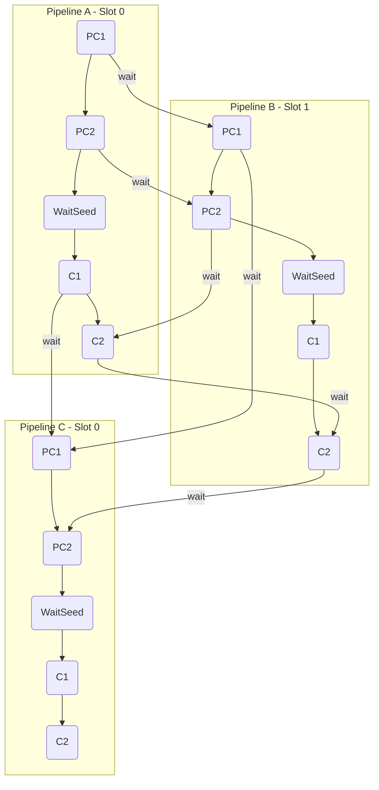

# SupraSeal pipeline demo

This executable provides a example of building a rust application to work with the SupraSeal primitives. The demo runs a series of sealing operations in parallel to illustrate how a pipeline can be constructed.

There is concept of a slot, which represents a set of compute resources allocated for PC1, PC2, C1, and C2. The expectation is there will be two slots which allows multiple sealing pipelines to run in parallel. There is coordination between the pipelines to ensure a specific resource is only used by one pipeline at once. For example to avoid GPU contention, PC2 in one pipeline should not run while PC2 or C2 is running in another pipeline. 

This is for illustration purposes. The timing of operations is dependent on available hardware and the number of sectors to seal.



## Running

Currently configured to run 3 pipelines of 32 sectors.

First make sure the supraseal-c2 library is setup in ../../c2

Also make sure the core library has been built:
```
./build.sh 512MiB

or for 32GiB sectors:
./build.sh
```

512MB Sectors
```
cargo build --release --features=512MiB --no-default-features
sudo ./target/release/supra-seal-demo
```

32GB Sectors
```
cargo build --release --features=32GiB --no-default-features
sudo ./target/release/supra-seal-demo
```
