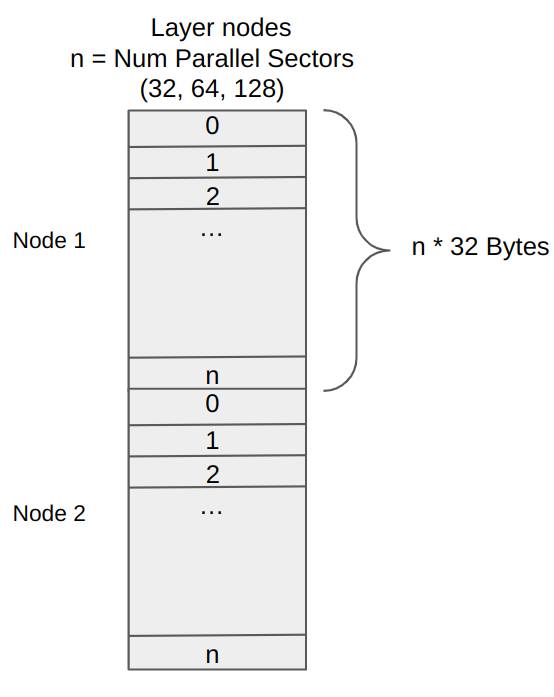

# Filecoin Optimized Sealing

This directory contains pc1 optimized for throughput per dollar. Improved throughput per dollar is accomplished in several ways:
- **Replace memory with NVMe** - This greatly reduces memory requirements, thereby reducing cost. The layers being hashed are stored in a relatively small in-memory cache, with the rest of the nodes stored on NVMe.
- **User space IO** - Using SPDK (https://spdk.io/) reduces overhead and latency to NVMe drives.
- **Increase core utilization** - In this implementation we are able to hash 4 sectors per core instead of 4 cores per sector with minimal latency impact. This dramatically reduces the amount of cores required on the system.

# Performance

This software supports sealing up to 128 sectors simultaneously and takes approximately 3.5 hrs, depending on the host. On a Threadripper PRO 5975WX (32 cores) with 12 NVMe drives attached it can perform PC1 for 64 sectors in 3 hours 30 minutes while requiring only 256 GB of memory. Note this latency is within a few percent of the theoretical best case 3 hours 26 minutes when operating at the all core boost frequency.

# Architecture and Design Considerations

The documentation that follows is not meant to be complete, but instead provides a high level overview of the various system components and how they interact. 

## Stacked DRG Background
Each layer of the graph consists of *N* 32 byte nodes that are created through a sequential hashing process. For a 32GB sector there are 1 billion nodes  *per layer* and the hashing process is repeated 10 times for a total of 11 layers. Each node in the graph references previous nodes from the current layer as well as the layer before. This creates a large IO requirement as approximately 13 reads are required to perform the hashing for each node.

## Design Considerations

In order to maximize throughput per dollar we need to ensure the platform resources are as utilized as possible. The PC1 operation requires serial computing and large amounts of data, therefore we need fast capable cores, lots of storage, and bandwidth to move that data around.

PC1 is dominated by SHA-256 hashing of an enormous amount of data from random locations. The way it is done in rust-fil-proofs is to store the graph's current working layer and the previous layer in RAM, use a couple of cores to prefetch data to a local shared cache, and have a single core perform the hashing. Storage Providers (SP) typically use  many core servers with 1-2 TB of RAM which enables them to perform PC1 on 15-30 sectors in parallel. There are two main issues with this approach, the cores are underutilized and the RAM requirement is very high. In a server, cores and RAM are the most expensive components.

Starting with the hashing first, we need a system that can perform SHA-256 with low latency. Fortunately, the last few generations of both AMD and Intel cores feature the SHA Extensions, which are a set of instructions that accelerate SHA-256 hashing. Diving further into SHA-256, there are 64 rounds per block that are provided with data from the message schedule each round. The SHA Extensions were designed with the intention of the rounds being the bottleneck and the message schedule instructions to be off the critical path. Now considering only the performance of the sha256rnds2 instruction, we can accurately model the compute requirements.

Each node in the graph requires 20 blocks of SHA-256 to determine its value. With 20 blocks * 64 rounds per block / 2 rounds per instruction, that requires 640 serial executions of sha256rnds2. The latest AMD processor microarchitectures (Zen3, Zen4) designed the instruction with a latency of 4 cycles and throughput of 1. This means for each node it will take 640 * 4 cycles = 2560 cycles to complete. If we expand that out for an entire 32GB graph, we have 11 layers * 2<sup>30</sup> nodes * 2560 cycles = 30,236,569,763,840 cycles (30 trillion!). To put this in time perspective, we divide the cycles by the core frequency in Hz to arrive at the number of seconds. For example a typical server in the 3.5 GHz range would take 8639 seconds (144 minutes), approximately 2 and a half hours. If we use a high end client part we can hit turbo frequencies closer to 6GHz, and at that speed it would only take 84 minutes. We now have a minimal latency bound to seal a 32GB sector.

Latency analysis is important to understand what the platform is capable of, although we are more concerned about optimizing for throughput in this exercise. Observe again the 4:1 latency:throughput for the SHA rounds instruction. Rather than let the pipelined acceleration circuits sit idle for 3 of the 4 serial cycles, we can fill them with different data streams. This is called a "multi-buffer" approach, where multiple independent data buffers are processed in parallel. This approach however makes things more nuanced since register pressure becomes an issue. Even though there are plenty of physical registers in the core, architecturally sha256rnds2 instructions only have 16 xmm registers. Assembly code for two buffers consumes 16 registers in the most performant form, therefore this limits our scaling to x2. An interesting experiment is to compare the latency of a x2 assembly implementation vs. a single buffer. Empirically we find that there is almost no latency degradation and we have the benefit of doubling the amount of data hashed in a given time without using any more resources. Since the optimal point for a 4 cycle latency instruction is a x4 implementation, we have a problem with the architectural register limit. However, this limitation can be overcome with hyper-threading. Each core is capable of running another thread in parallel to the current thread, with its own set of resources (registers). Empirically what we have found is not perfect scaling as with the x2. This makes sense because the CPU has limits on how many instructions can be issued per cycle, retired per cycle, and on which port the instruction can be executed on. The good news is performance is super linear in throughput and we find that running 2 x2 threads on a core does provide the best result (4200 cycles for 4 buffers vs the 2560 for one).

Having determined from a SHA-256 perspective that we are optimal at running 4 sectors at once per core, we now need to figure out how to feed the data to those cores and how many we can do in parallel. This requires going back to the graph to determine what data is needed. In the common case there are six parents from the current layer (one of which is the previous node) and 8 expander parents (from the previous layer). Looking deeper into the graph we can analyze the expected distance of a base parent from the current node. If we create buckets for each distance using a logarithmic scale, we find a relatively equal percentage for each bucket (2-9, 10-99, 100-999, 1000-9999, etc). This means that if we keep a small cache of recent nodes, say 1M, there is a greater than 50% chance of a base parent being resident. Of the fourteen parents, we can be expected to have 3 or 4 in the cache and the rest will need to be fetched. 

Our overall approach of replacing RAM with NVMe disks to lower cost means we are getting approximately 4 nodes from RAM and the other 10 from NVMe. If we are doing 4 buffers per core in 4200 cycles, and we assume that the cores are running at 4 GHz, then it will take 1.05 microseconds. Looking at it another way, the cores can process 1M nodes per second per buffer. Assuming 10 random reads per node, that means we need 10M IOPS per buffer. The current state of the art NVMe drives top out around 1M random read IOPS with careful tuning. To feed a single core's four buffers would take around 40 NVMe drives to service. Most motherboards max out at supporting 10-25 drives. Clearly a straightforward approach will not work here.

The solution we have is to interleave buffers stored on NVMe and to spread the nodes across many drives. To do this we work with a fundamental 4KB block of data. If each block of data supports many buffers, we can limit the number of random reads required. Now instead of needing 40M IOPS per core, we need only 10M IOPS total for all cores. With about 12 NVMe drives we are able to reach that 10M IOPS requirement. To do this requires eliminating the filesystem and bypassing the operating system to directly control the drives. It also requires careful coordination across the processor and the majority of this code is dedicated to that.

## Stacked DRG - Efficient Data Layout For High Throughput PC1

This software supports sealing 1-32, 64, and 128 32GB CC sectors in parallel. In order to support a high level of parallelism without increasing the cost of the system we ensure that the resources of the system are well utilized. One way to improve resource utilization is to lay out the data in a way that is efficient for IO operations like disk reads and writes. The current PC1 software writes each layer of a sector sequentially to disk. When performing PC1 for 64 sectors in parallel with this data layout, each node requires 13 reads (there are 13 parents to read) to perform the hash. However, disk reads are natively 4KB in size and only 32B from each of those reads is used, so much of the data from the read is wasted.

To address this inefficiency we lay the data out in a more usable way. Since all sectors will use the same parent graph, we know that they will require the same pattern of reads. This opens the door to sharing each read across all sectors we're hashing. This effectively 'ammortizes' the cost of the read across all of the sectors being sealed in parallel. 

To achieve this we organize the data as shown below.



If *n* = 64, then we put all the node 1 data together, then all of the node 2 data, etc. So 32 bytes of sector 0 node 1, then 32 bytes of sector 1 node 1, up to sector 63. In the case of 64 sectors, node 1 and node 2 fit in the first 4KB page, then node 3 and node 4 in the next, etc. 

With this layout, reading the data for a specific node (i.e. a single 4KB read) gets us the data for all of the sectors we are sealing (up to 128 sectors) in a single read, exactly what we want for improving page read utilization.

## Multiple Disks

However, it turns out that a single disk is not sufficient for our storage and IO needs here, either in terms of storage capacity or performance.

From a capacity point of view we need to store 32GB * 11 layers for each sector we want to seal. For 64 sectors this adds up to 22 TB. 

We also need to support the random read IOPS necessary for good performance. Each node that gets sealed needs to consume 14 parents. One of those parents is the previous node, which we can reuse since it was just hashed. That leaves 13 parents, of which about 3 are close enough in the layer that we can use an in-memory cache to service them. That leaves about 10 random reads per node. Fortunately we get all 64 sectors in that read, so our IOPS needs don't change when performing PC1 for more sectors in parallel.

In order to perform PC1 in 3.5 hours we need approximately 10 million IOPS.

The image below shows an example layout with 4 disks. The data is arranged by placing consecutive pages on consecutive disks, so page 0 is on disk 0, page 1 disk 1, page 2 disk 2, page 3 disk 3, then page 4 disk 0, etc. This gives us random read IOPS scaling that is approximately linear with the number of disks. 


## Software Architecture

Finally, we show the high level software architecture below. The basic challenge we need to overcome is providing data to the CPU cores performing SHA hashing at a rate that keeps them fully utilized. This is a big challenge since the latency of reading from NVMe is very long relatively speaking. However, we know what needs to be read well in advance, so we solve the latency problem by reading well in advance and buffering the data. 

In the end the majority of the software is dedicated to delivering data to the hashing cores on time, with extremely low overhead. At 10 million IOPS a single core has fewer than 500 cycles to dedicate to each page!


The drawing shows a number of structures
- **Threads** - depicted by the wavy vertical boxes
- **Buffers** - depicted by a series of small horizontal boxes
- **Disks** - depicted by cylinders
- **Data flow** - depicted with arrows

### Buffers

There are a few major buffers to be aware of.
- **parents_buffer** - Holds parent node data read from disk. Data is DMA'd into the buffer by the disk. A valid bit indicates when the data is ready for consumption.
- **parent_pointers** - Holds pointers to the parent data, either to the parents buffer or to the node buffer, which acts as an in-memory cache. 
- **node_buffer** - Stores hashed nodes that are ready to to be written to disk. Also acts as an in-memory cache for parent nodes, reducing the disk IO requirements.
- **sync buffers** - Various buffers, stores synchronization data to ensure data in the buffers is not deallocated until all consumers have used it.
- **local data buffers** - Small buffers between coordinators and hashers that store parent data in a cache friendly contiguous buffer.

All of the major buffers are allocated in pinned memory using huge pages. Pinning enables data to be DMA'd over PCIe, freeing up cores to do other work. Huge pages reduces the number of TLB entries needed, dramatically reducing the TLB misses that would normally occur with a large data set.

### Disk IO

The foundation of the storage portion is SPDK. SPDK allows for very low level user space access to disks, eliminating system call and kernel overhead. Within those disks there are no files, simply raw blocks (pages). All sector/node data is stored this way, reading and writing in 4KB blocks at a time. This is shown on the right side of the drawing, where the `Parent Reader` and `Node Writer` threads handle the raw disk IO. Read and write requests are sent to these threads, which then service them using the attached drives.

Also on the right is the cached `Parent graph`. Unlike sector/node data, the throughput needs are low enough that it is simply read from the linux filesystem.

Each disk IO thread is affinitized to a dedicated core. 

### Orchestrator

The orchestrator manages the overall data flow. It reads the parent graph, initiates node reads and writes, and manages the parent and node buffers. To keep the buffers coherent it tracks coordinator and hasher progress to make sure data in `parents_buffer` is kept around until it is no longer needed, nodes are written to disk once they are hashed, and data in the `node_buffer` can be used as an in memory cache. 

The orchestrator thread is affinitized to a dedicated core. 

### Coordinators

Coordinators run per core complex (CCX) and place node data in the L3 cache so that it is ready for hashers to consume. Since we use the `node_buffer` as a cache the node data is fairly scattered in memory i.e. it is not easily predictable by the hardware prefetcher. As a result cache misses significantly impact performance if not managed carefully. 

The coordinators gather the node parent data from the `parents_buffer` and `parent_pointers` into a small local contiguous ring buffer that is used by the hashers. 

Each coordinator thread is affinitized to a dedicated core. 

### Hashers

The hashers consume the data provided by the coordinators and perform the SHA hashing required to compute the node label. They write the data directly into the `node_buffer`, which then flows back out to disk for storage. 

This software hashes 2 sectors per thread, with 2 threads locked to each core using hyperthreading, resulting in 4 sectors being hashed per physical core.

### Topology

The system needs to be aware of the CPU caching structure to operate optimally. The image below is from `lstop` and shows the cpu core and caching structure.


This CPU has a 4 core complexes, each with 8 cores. The core complex has a shared L3 cache, and each core has a private L1 and L2 cache. 

For 64 sectors we assign threads as follows (keeping in mind that each `hasher` hashes two sectors):
```
CCX    Core       thr0              thr1 (Hyperthread)
 0       0     node_writer
 0       1     parent_reader
 0       2     orchestrator
 0       3     coordinator 0
 0       4     hasher 0           hasher 1
 0       5     hasher 2           hasher 3
 0       6     hasher 4           hasher 5
 0       7     hasher 6           hasher 7
 1       8     coordinator 1
 1       9     hasher 8           hasher 9
 1      10     hasher 10          hasher 11
 1      11     hasher 12          hasher 13
 1      12     hasher 14          hasher 15
 1      13     hasher 16          hasher 17
 1      14     hasher 18          hasher 19
 1      15     hasher 20          hasher 21
 2      16     coordinator 2
 2      17     hasher 22          hasher 23
 2      18     hasher 24          hasher 25
 2      19     hasher 26          hasher 27
 2      20     hasher 28          hasher 29
 2      21     hasher 30          hasher 31

```

With this configuration each core complex has a coordinator that pulls node data from main memory into the L3 where the hasher threads use it for node labeling.

