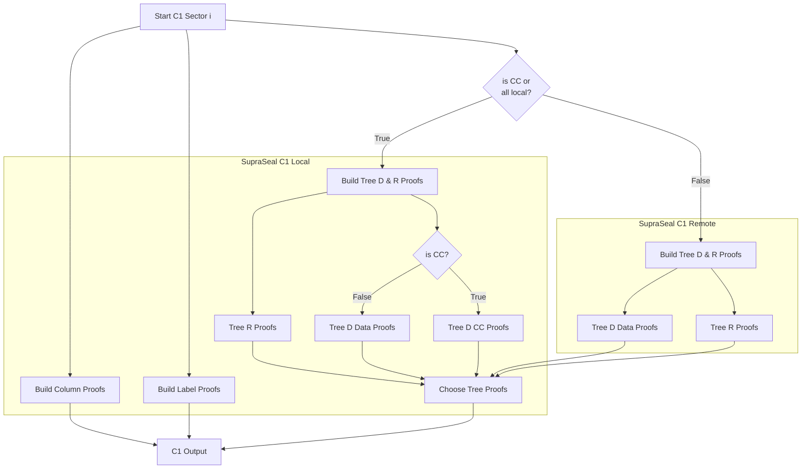

# Commit 1

Once the security wait time has passed since the pre-commitment, randomness is collected from the chain to create a series of challenges. The Commit 1 (C1) phase is the process of deriving those node challenges and generating associated inclusion proofs.

## Intended Usage

The SupraSeal C1 functions operate on a single sector at a time given they are not performance critical and the randomness of the challenges do not aid in amortizing NVME reads across parallel sectors. There are two factors which determine how the SupraSeal library is used to generate the C1 proofs. The first is whether or not this is a CC sector and the second is whether or not the tree proofs will be generated locally. For CC and local non-CC sectors a single function call will cover the entire operation. The only difference there would be providing a path to the Tree D and Replica files as opposed to using the known structure of CC Tree D and pulling Replica from the interleaved last layer on NVME. For scenarios where the data is not present locally, the remote host which holds the data and replica would be responsible for building the tree proofs and returning them. The tree proofs would be combined with the locally generated column and label proofs to produce the C1 output. There are SupraSeal functions in place to support computation of the various models with orchestration left to the application. 

