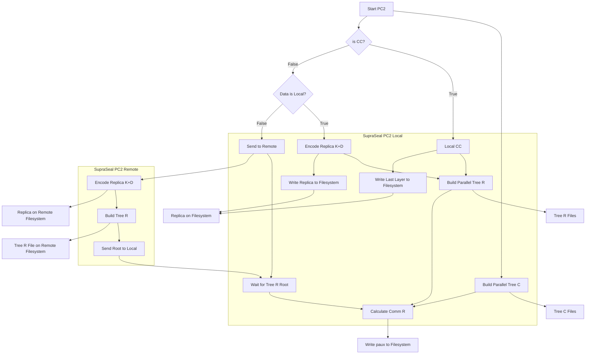

# Pre-Commit 2

The Pre-Commit 2 (PC2) phase generates the Poseidon based merkle trees over the columns in the graph and the replica. 

## Intended Usage

The SupraSeal PC2 functions generate Tree C files, Tree R files, Comm R, and the Replica. The Tree C files are always generated in parallel using the graph layers in NVME. If the sectors are CC sectors, then everything else is generated locally as well using the graph layers. There are options the application can utilize depending on if non-CC sectors have the data local to the sealing operation or are stored remotely.

